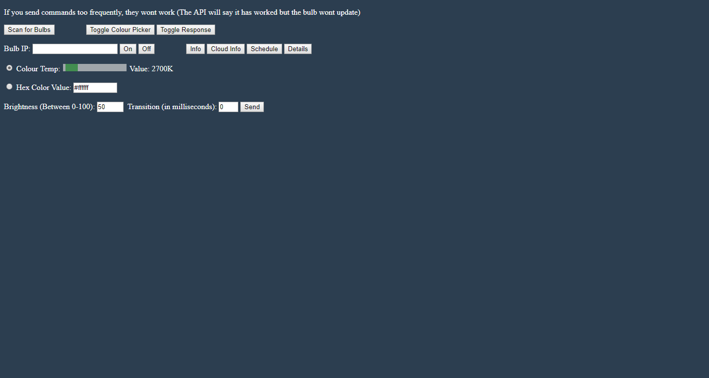

# TP-Link-Smart-Bulb-REST-API-With-Interface

A REST API to control the TP-Link Smart bulbs that also includes a web interface.

Here is a screen shot of the web interface, It doesn't look great but it works :)



Uses Konsumer's [tplink-lightbulb API](https://github.com/konsumer/tplink-lightbulb)

The color picker on the interface was taken from [w3schools](https://www.w3schools.com/colors/colors_picker.asp)

Basically mirrors most of the commands from Konsumer's API (Not all commands were added as it didn't seem necessary), This is useful for using it with things like Tasker.

You can then simply run the server.js using``` node server.js ```and go to http://localhost:8080 in your browser.

This has been tested using an LB130 but should work for any of the bulbs listed in Konsumer's README.


## Implemented Commands

<dl>
<dt><a href="#module_scan">scan</a></dt>
<dd><p>Scan for lightbulbs on your network</p>
</dd>
<dt><a href="#module_info">info</a></dt>
<dd><p>Get info about the TPLSmartDevice</p>
</dd>
<dt><a href="#module_power">power</a></dt>
<dd><p>Set power-state of lightbulb</p>
</dd>
<dt><a href="#module_cloud">cloud</a></dt>
<dd><p>Get cloud info from bulb</p>
</dd>
<dt><a href="#module_schedule">schedule</a></dt>
<dd><p>Get schedule from bulb</p>
</dd>
<dt><a href="#module_details">details</a></dt>
<dd><p>Get operational details from bulb</p>
</dd>
</dl>

<a name="module_scan"></a>

## scan
Scan for lightbulbs on your network

Add <code>/api?cmd=scan</code> to the URL

**Returns**: IP Addresses of found bulbs

<a name="module_scan"></a>

<a name="module_info"></a>

## info
Get info about the TPLSmartDevice

Add <code>/api?cmd=info</code> and the IP of the bulb with <code>&ip=0.0.0.0</code> to the URL

**Returns**: Bulb info in JSON

<a name="module_power"></a>

## power
Set power-state of lightbulb

##### Turn the bulb on

Add <code>/api?cmd=power&st=on</code> and the IP of the bulb with <code>&ip=0.0.0.0</code> to the URL to turn the bulb on

##### Turn the bulb off

Add <code>/api?cmd=power&st=off</code> and the IP of the bulb with <code>&ip=0.0.0.0</code> to the URL to turn the bulb off

##### Set other state settings

Add <code>/api?cmd=power</code> and the IP of the bulb with <code>&ip=0.0.0.0</code> to the URL

Add <code>&ct=COLOUR TEMP HERE IN KELVIN -  JUST THE NUMBER</code> to set the bulb to a specific colour temp OR add <code>&hue=HEX CODE WITHOUT #</code> to set the bulb to a specific hue

Optional parameters include:

Set the brightness with <code>&bri=NUMBER BETWEEN 1-100</code> 

Set the transition period with <code>&trans=NUMBER IN MILLISECONDS</code> 


**Returns**: Bulb State Updated 

<a name="module_cloud"></a>

## cloud
Get cloud info from bulb

Add <code>/api?cmd=cinfo</code> and the IP of the bulb with <code>&ip=0.0.0.0</code> to the URL

**Returns**: Bulb cloud info in JSON  

<a name="module_schedule"></a>

## schedule
Get schedule from bulb

Add <code>/api?cmd=schedule</code> and the IP of the bulb with <code>&ip=0.0.0.0</code> to the URL

**Returns**: Bulb schedule info in JSON 

<a name="module_details"></a>

## details
Get operational details from bulb

Add <code>/api?cmd=details</code> and the IP of the bulb with <code>&ip=0.0.0.0</code> to the URL

**Returns**: Bulb operational details in JSON
